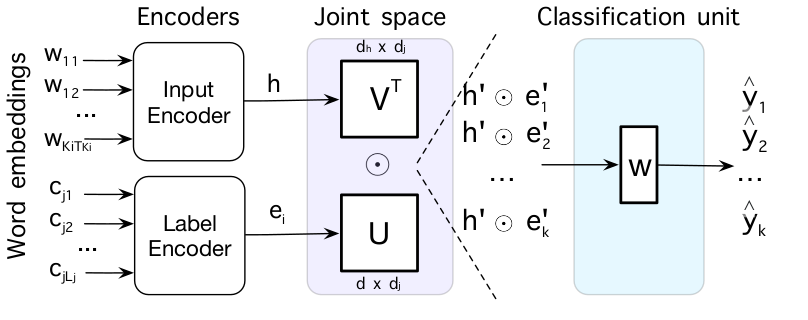
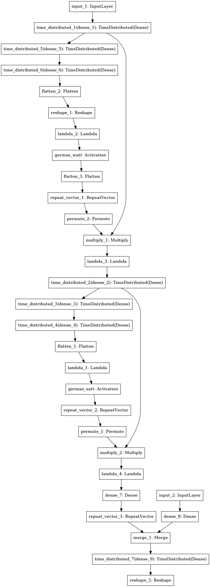
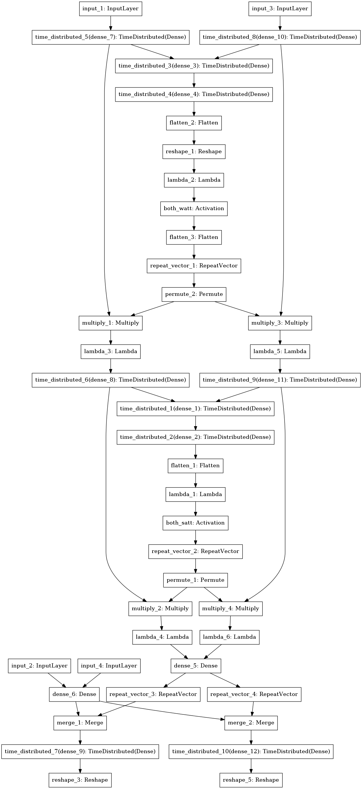
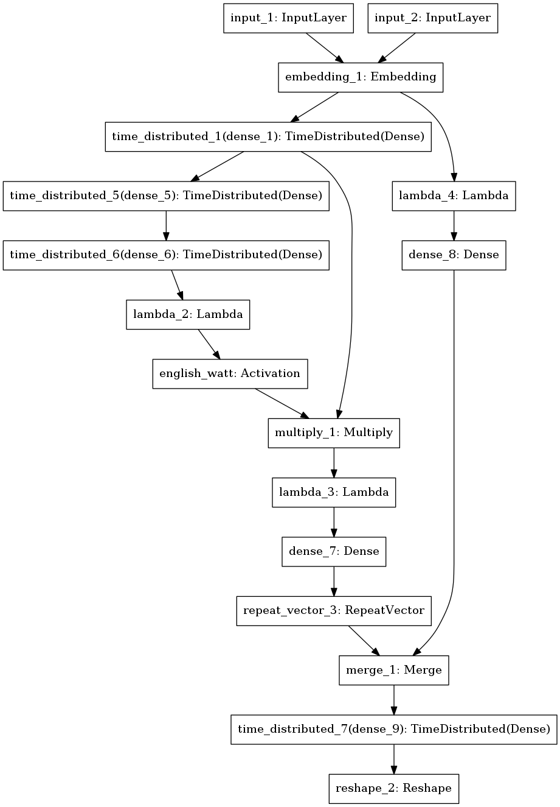

<b>gile</b> —
This repository contains a Keras implementation of GILE, a generalized input-label embedding for large-scale text classification, which was proposed in TACL 2019 [<a href="https://arxiv.org/pdf/1806.06219.pdf">1</a>]. The overall model consists of a joint non-linear  input-label embedding with controllable capacity and a joint-space-dependent classification unit which is trained with cross-entropy loss to optimize classification performance. GILE improves over monolingual and multilingual models which do not leverage label semantics [<a href="https://arxiv.org/pdf/1707.00896.pdf">2</a>] and previous joint input-label space models for text [<a href="http://www.aclweb.org/anthology/D15-1027">3</a>, <a href="https://www.aaai.org/ocs/index.php/AAAI/AAAI16/paper/view/12058/11827">4</a>] in both full-resource and low or zero-resource scenarios.

<p align="center">
<a href="https://arxiv.org/pdf/1806.06219.pdf"></a>
</p>

```
@article{Pappas_TACL_2019,
    author = {Pappas, Nikolaos and Henderson, James},
    title = {GILE: A Generalized Input-Label Embedding for Text Classification},
    journal = {Transactions of the Association for Computational Linguistics (TACL)},
    volume = {7},
    year = {2019}
}
```

Getting started
------------
The provided code allows to reproduce the two experiments decribed in the paper:

* **Multilingual text classification**: Under the main folder (./) you can find the code related to the multilingual text classification experiments on DW dataset from [<a href="https://arxiv.org/pdf/1707.00896.pdf">2</a>].  

* **Biomedical semantic indexing**: Under the hdf5/ folder you can find the code related to the biomedical text classification experiments on BioASQ dataset from [<a href="https://www.aaai.org/ocs/index.php/AAAI/AAAI16/paper/view/12058/11827">4</a>]. We created a separate code to provide support for large-scale datasets like BioASQ (10M) using the HDF5 format and for trainable word embeddings.  


### Installation
The available code for GILE requires <a href="http://www.python.org/getit/">Python 2.7</a> programming language and <a href="http://www.pip-installer.org/en/latest/">pip</a> package manager to run.
For detailed instructions on how to install them please refer
to the corresponding links. Next, you should be able to install the required libraries as follows using the provided list of dependencies: <br />
```
pip install -r dependencies.txt
```
To avoid creating library conflicts in your existing pip environment, it may be more convenient for you to use a folder-specific pip environment using <a href="https://github.com/pypa/pipenv">pipenv</a> instead. For setting up your GPUs to work with Theano please refer to <a href="http://deeplearning.net/software/theano/install_ubuntu.html">here</a> and  <a href="http://deeplearning.net/software/theano/tutorial/using_gpu.html">here</a>. For example, the theano configuration for running our experiments on GPUs with <a href="https://developer.nvidia.com/cuda-downloads">CUDA 8.0</a> and <a href="https://developer.nvidia.com/cudnn">cuDNN 5110</a> was the following one:
```
THEANO_FLAGS='cuda.root=<path>/CUDA-8.0, mode=FAST_RUN, dnn.enabled=True, device=gpu, lib.cnmem=0.9'
```
**Note**: A large portion of this repository is borrowed from <a href="https://github.com/idiap/mhan">mhan</a> toolkit, so for networks which have typical sigmoid output layer parametrizations please consider using and acknowledging that toolkit instead.  


# Multilingual text classification  
This section describes how to obtain the task prerequisites (datasets, pretrained word vectors) and how to use the basic code functionality needed to perform multilingual text classification experiments on DW dataset from [<a href="https://arxiv.org/pdf/1707.00896.pdf">2</a>].

Prerequisites
-------------
To get started, please follow the steps below to obtain the required data and the pretrained word vectors:
1. Request and download the compressed file containing the pre-processed DW dataset from [<a href="https://arxiv.org/pdf/1707.00896.pdf">2</a>] (see Datasets in <a href="https://github.com/idiap/mhan">mhan</a>) and unzip its contents under the data/ folder:
```
mkdir data; cd data;
# Copy the compressed data files to data/ folder.
unzip dw_general.zip dw_specific.zip
```
2. Download the compressed files with the pretrained aligned word embeddings in pickle format from <a href="https://github.com/idiap/mhan">mhan</a> repository and unzip its contents under the main folder:
```
cd ../;mkdir word_vectors; cd word_vectors;
for lang in {english,german,spanish,portuguese,ukrainian,russian,arabic,persian}; \
do wget https://github.com/idiap/mhan/raw/master/word_vectors/$lang.pkl.gz ; done
```

Usage
---------------
```
$ python run.py --help
Using Theano backend.
usage: run.py [-h] [--wdim WDIM] [--swpad SWPAD] [--spad SPAD] [--sdim SDIM]
              [--ddim DDIM] [--ep EP] [--ep_size EP_SIZE] [--bs BS]
              [--enc ENC] [--act ACT] [--gruact GRUACT] [--share SHARE]
              [--t T] [--seed SEED] [--args_file ARGS_FILE]
              [--wordemb_path WORDEMB_PATH]
              [--languages LANGUAGES [LANGUAGES ...]] [--data_path DATA_PATH]
              [--path PATH] [--target TARGET] [--source SOURCE]
              [--store_file STORE_FILE] [--max_num MAX_NUM] [--train] [--test]
              [--store_test] [--onlylabel] [--onlyinput] [--la]
              [--ladim LADIM] [--laact LAACT] [--lashare]
(...)
```

Usage: Training models
-------------
To train a model we have to specify the --train argument in the run.py file. For each specified language, the script will automatically load the training and validation sets stored under the specified data folder and train the model on them. At each epoch the script will store a snapshot of the model along with its validation scores (precision, recall and F1-score) under the specified folder for all the languages involved in the training e.g. under exp/<language_1>/, exp/<language_2>/. In case the script detects already stored models for multiple epochs in the specified folder, it will continue training from the model stored at the last epoch.  

### Monolingual
For example, to train a mononolingual HAN with DENSE encoders and GILE output layer (GILE-HAN) on general German categories we execute the following command:
```
python run.py --train --languages german --wordemb_path word_vectors/ --data_path=data/dw_general \
  --path exp/bi-gen/mono/gile-han-att --wdim 40 --swpad 30 --spad 30 --sdim 100 --ddim 100 --ep 300 \ 
  --bs 16 --enc attdense --act relu --la
```

### Multilingual
For example, to train a multilingual HAN with DENSE encoders, shared attention and GILE output layer (GILE-MHAN-Att) on general English and German categories we execute the following command:
```
python run.py --train --languages english german --wordemb_path word_vectors/ --data_path=data/dw_general \
--path exp/bi-gen/multi/en-de/gile-mhan-att --wdim 40 --swpad 30 --spad 30 --sdim 100 --ddim 100 --ep 300 \
--bs 16 --enc attdense --act relu --share att --la --lashare
```

**Note**: With the above commands you can also run the experiments for the rest of the languages in the monolingual case and the rest of the language-pair combinations in the multilingual case by changing the --languages argument.

Usage: Testing models
-------------
To test a model we have to specify the --test argument in the run.py file and simply point to the directory of the model that we would like to evaluate and the language on which we would like to evaluate using the --target argument. The script will select the model with the best validation score in the specified directory and test it on the corresponding test set. When using the testing function, the architecture of the model is also plotted and stored in the specified directory (see below).

### Monolingual
Using the previous example, we can test the above mononolingual HAN with DENSE encoders and GILE output layer (GILE-HAN) on the  corresponding German test set as follows:
```
python run.py --test --path exp/bi-gen/mono/gile-han-att --target german --la --t 0.40
```

### Multilingual
Using the previous example, we can evaluate the above multilingual HAN with DENSE encoders, shared attention and GILE output layer (GILE-MHAN-Att) on the corresponding German test set as follows:
```
python  run.py --test --path exp/bi-gen/multi/en-de/gile-mhan-att --target german --t 0.40
```

<table>
<tr>
	<td style="vertical-align:top;width:50%;text-align:center"><center><b>HAN with Dense encoders + GILE output layer</b><br><br></center></td>
	<td style="vertical-align:top;width:50%;text-align:center"><center><b>MHAN with Dense encoders + GILE output layer </b><br><br></center></td>
</tr>
</table>


Usage: Other
-------------
For other functionalities such as storing attention weights and visualizing them please check <a href="https://github.com/idiap/mhan">mhan</a> toolkit.

Pretrained models
-------------
Apart from the code, we also provide under pretrained/ folder the configurations of the best-performing models with GILE output layer from the full-resource experiments in [<a href="https://arxiv.org/pdf/1806.06219.pdf">1</a>] (Tables 2 and 4):

1. **bi-gen/**: Bilingual models with DENSE encoders and GILE output layer trained on general categories (Table 2, upper part).
2. **bi-spe/**: Bilingual models with DENSE encoders and GILE output layer trained on specific categories (Table 2, lower part).
3. **enc-gen/**: Monolingual models with varying encoders (DENSE, GRU, biGRU) and GILE output layer trained on general categories (Table 4).


### Testing
The command below evaluates the English-German MHAN model with DENSE encoders and GILE output layer, which was trained on general English and German categories, on the corresponding English test set. The resulting F1-score should match the one in the corresponding column of Table 3 in [<a href="https://arxiv.org/pdf/1806.06219.pdf">1</a>].

```
python run.py --test --path pretrained/bi-gen/multi/en-de/gile-mhan-att --target english  --t 0.4
```

### Retraining
To train the model from scratch using the same configuration (args.json) and initial weights as in [<a href="https://arxiv.org/pdf/1806.06219.pdf">1</a>], one has to simply remove the optimal pretrained model files from the specified path folder as follows:

```
rm  pretrained/bi-gen/multi/en-de/gile-mhan-att/english/*_[1-9]*-*
rm  pretrained/bi-gen/multi/en-de/gile-mhan-att/german/*_[1-9]*-*
python run.py --path pretrained/bi-gen/multi/en-de/gile-mhan-att/ --languages english german --train
```

**Note**: We also provide upon request the configurations and initial weights of any other model used in the paper.


# Biomedical semantic indexing
This section describes how to obtain the task prerequisites (datasets, pretrained word vectors) and how to use the basic code functionality needed to perform biomedical semantic indexing experiments on the BioASQ dataset from [<a href="https://www.aaai.org/ocs/index.php/AAAI/AAAI16/paper/view/12058/11827">4</a>]. Compared to the code for the previous experiments, this version of the code differs in the following ways: i) it supports trainable word embeddings, ii) it uses the HDF5 format for efficiently storing and accessing large-scale datasets and iii) supports zero-shot evaluation.

Prerequisites
-------------
To get started, please follow the steps below to obtain the required data and (optionally) the pretrained word vectors:
1. Download our pre-processed version of the BioASQ dataset according to [<a href="https://www.aaai.org/ocs/index.php/AAAI/AAAI16/paper/view/12058/11827">4</a>] stored in HDF5 format (or pre-process the data yourselves and store them in the same format):   
```
cd hdf5;mkdir data;cd data;
wget https://raw.githubusercontent.com/circulosmeos/gdown.pl/master/gdown.pl; chmod +x gdown.pl;
./gdown.pl https://drive.google.com/open?id=16TcpunnhNyPIWoy4RSkIICVYDZSKDpzU bioasq.tar.gz
tar -zxvf bioasq.tar.gz
```
2. (Optional) Use the pretrained word vectors by storing them under the hdf5/ folder:
```
cd ../;mkdir word_vectors;
wget https://raw.githubusercontent.com/circulosmeos/gdown.pl/master/gdown.pl; chmod +x gdown.pl;
./gdown.pl https://drive.google.com/open?id=1zu4l4bRcqiTwqNXrZI8gDPC1sxrDJsBf bioasq-word_vectors.zip
unzip bioasq-word_vectors.zip
```

Usage
---------------
```
$ cd hdf5/; python run.py --help
Using Theano backend.
usage: run.py [-h] [--wdim WDIM] [--wsize WSIZE] [--lpad LPAD] [--wpad WPAD]
              [--sampling SAMPLING] [--swpad SWPAD] [--spad SPAD]
              [--sdim SDIM] [--ddim DDIM] [--ep EP] [--ep_size EP_SIZE]
              [--epval_size EPVAL_SIZE] [--bs BS] [--enc ENC] [--act ACT]
              [--gruact GRUACT] [--share SHARE] [--t T] [--seed SEED]
              [--args_file ARGS_FILE] [--wordemb_path WORDEMB_PATH]
              [--languages LANGUAGES [LANGUAGES ...]] [--data_path DATA_PATH]
              [--path PATH] [--target TARGET] [--source SOURCE]
              [--store_file STORE_FILE] [--chunks CHUNKS] [--train] [--test]
              [--store_test] [--mode MODE] [--pretrained] [--maskedavg]
              [--chunks_offset CHUNKS_OFFSET] [--onlylabel] [--onlyinput]
              [--la] [--ladim LADIM] [--laact LAACT] [--lashare]
              [--seen_ids SEEN_IDS] [--unseen_ids UNSEEN_IDS]
(...)
```

Usage: Training
---------------
As in the previous section, to train a model we have to specify the --train argument in the run.py file. For each specified language, the script will automatically load the training and validation sets stored under the specified data folder and train the model on them. At each epoch the script will store a snapshot of the model along with its validation scores (precision, recall and F1-score) under the specified folder for all the languages involved in the training e.g. under exp/<language_1>/, exp/<language_2>/. In case the script detects already stored models for multiple epochs in the specified folder, it will continue training from the model stored at the last epoch.  

For example, to train a WAN with DENSE encoders and GILE output layer (GILE-HAN) on the BioASQ dataset we execute the following command:
```
python run.py --languages english --data_path data/bioasq/ --path exp/gile-wan --train \
--wdim 100 --bs 64 --sampling 0.03 --la --ladim 500 --lpad 50 --maskedavg
```

Usage: Testing
---------------
As in the previous section, to test a model we have to specify the --test argument in the run.py file and simply point to the directory of the model that we would like to evaluate and the language on which we would like to evaluate using the --target argument. The script will select the model with the best validation score in the specified directory and test it on the corresponding test set. When using the testing function, the architecture of the model is also plotted and stored in the specified directory (see below). One key difference with the previous section is that the test functionality allows to evaluate on a particular subsets of the test set, namely the ones that have labels that been seen during training and the ones that have labels which have not been seen during training (zero-shot setting).

For example, to evaluate a WAN with DENSE encoders and GILE output layer (GILE-HAN) on the seen labels during training we execute the following command:
```
python run.py --test --path exp/gile-wan --target english --mode seen --chunks 50 --bs 8
```

To evaluate on the unseen labels during training, we execute the following command:
```
python run.py --test --path exp/gile-wan --target english --mode unseen --chunks 5 --bs 8
```

**Note**: The results of the first script above are stored under the predifined folder (--path) in separate files and should be averaged to obtain the final score over the whole test set.

<table>
<tr>
<td style="vertical-align:top;width:100%;text-align:center"><center><b>WAN with Dense encoders + GILE output layer</b><br><br></center></td>
</tr>
</table>

Usage: Other
-------------
For other functionalities such as storing attention weights and visualizing them please check <a href="https://github.com/idiap/mhan">mhan</a> toolkit.

Pretrained models
---------------
Apart from the code, we also provide under pretrained/ folder the configurations of the best-performing model that uses GILE output layer from the experiments in [<a href="https://arxiv.org/pdf/1806.06219.pdf">1</a>] (Table 1):

1. **gile-wan/**: Model with DENSE encoders and GILE output layer on general categories (Table 1). Due to its big size this pretrained model is hosted externally and can be obtained as follows: 
```
cd hdf5; wget https://raw.githubusercontent.com/circulosmeos/gdown.pl/master/gdown.pl ; chmod +x gdown.pl;
./gdown.pl https://drive.google.com/open?id=1Xq8-9KBLEBRoTzOMAIqqzXueq0_ciLML bioasq-pretrained.zip
unzip bioasq-pretrained.zip  
```

### Testing
The command below evaluates the WAN model with DENSE encoders and GILE output layer on the seen labels during. The resulting average F1-score should match the one in the corresponding column of Table 1 in [<a href="https://arxiv.org/pdf/1806.06219.pdf">1</a>].

```
python run.py --test --path pretrained/gile-wan --target english --mode seen --chunks 50 --bs 8
```
### Retraining
To train the model from scratch using the same configuration (args.json) and initial weights as in [<a href="https://arxiv.org/pdf/1806.06219.pdf">1</a>], one has to simply remove the optimal pretrained model files from the specified path folder as follows:

```
rm  pretrained/gile-wan/*_[1-9]*-*
python run.py --path pretrained/gile-wan/ --train
```
**Note**: We also provide upon request the configurations and initial weights of any other model used in the paper.

References
------------
* [1] Nikolaos Pappas, James Henderson, <a href="https://arxiv.org/pdf/1806.06219.pdf">GILE: A Generalized Input-Label Embedding for Text Classification</a>, Transactions of the Association for Computational Linguistics, 2019
* [2] Nikolaos Pappas, Andrei Popescu-Belis, <a href="https://arxiv.org/pdf/1707.00896.pdf">Multilingual Hierarchical Attention Networks for Document Classification</a>, 8th International Joint Conference on Natural Language Processing , Tapei, Taiwan, 2017
* [3] Mazid Yazdani, James Henderson <a href="http://aclweb.org/anthology/D15-1027">A Model of Zero-Shot Learning of Spoken Language Understanding</a>, Proceedings of the 2015 Conference on Empirical Methods in Natural Language Processing, Lisbon, Portugal, 2015
* [4] Jinseok Nam, Eneldo Loza Mencía, Johannes Fürnkranz, <a href="https://www.aaai.org/ocs/index.php/AAAI/AAAI16/paper/view/12058/11827">All-in Text: Learning Document, Label, and Word Representations Jointly</a>, Proceedings of the 30th AAAI Conference on Artificial Intelligence, Phoenix, USA, 2016

Acknowledgements
------------
 We are grateful for funding to the European Union's Horizon 2020 program through the SUMMA project (Research and Innovation Action, grant agreement n. 688139): Scalable Understanding of Multilingual Media, see <a href="http://www.summa-project.eu/">http://www.summa-project.eu/</a>.

## Contact:
npappas@idiap.ch
